x)  
Karvinen 2014: Hello Salt Infra-as-Code  
-  
- Tässä esitetään kansion luominen Saltissa, josta tehdään idempotenttinen.  
- Salt pitää huolen, että kansio on olemassa.  

Salt contributors: Salt overview:  
-
YAML on formaatti, miten data rakentuu ja näkyy Saltissa.  

YAML rakenteen kolme osaa ovat:  
- Scalars/Skalaarit = Näissä arvoina voi olla numero, merkkijono tai totuusarvo.  
- Lists/Listat = listoissa on tavuviiva, arvo ja kaksi välilyöntiä lopussa. Arvot esitetään omilla riveillään.  
- Dictionaries/Sanakirjat = Nämä ovat scalaareista tehtyjä kokoelmia.  

YAML lohkorakenteet  
-
- YAML lohkorakenteissa on sisennettävä ominaisuudet yhdellä tai kahdella välilyönnillä. Ilman tätä tulee virhe.  

Salt contributors: The top file
-
- Päätiedosto/"Top file" kertoo, mitkä asetukset koskevat mitäkin orjia.  
  Päätiedostoon kuuluu kolme asetusta:  
  - Ympäristö: Tilapuuhakemisto, josta haetaan tilatiedostot asetuksia varten.  
  - Kohde: Ryhmä koneita, joille asetataan tila.  
  - Tilatiedostot: Lista tilatiedostoista, joita käytetään kohteessa. Jokainen tilatiedosto kuvaa yhden tai useamman tilan, jotka otetaan käyttöön.  

Oracle VirtualBox tekniset tiedot  
Debian 13 Trixie  
4 Ydintä  
RAM: 4096 MB  

a) Hei infrakoodi! Kokeile paikallisesti (esim 'sudo salt-call --local') infraa koodina. Kirjota sls-tiedosto, joka tekee esimerkkitiedoston /tmp/ -kansioon.  
-

Aloitus
28.10.2025 09:31 sudo apt-get update  
28.10.2025 09:32 sudo apt-get -y install salt-minion  
(Salt oli jo asennettu)  

28.10.2025 09:33 sudo apt-get -y install micro  
28.10.2025 09:33 export EDITOR=micro  
28.10.2025 09:36 sudo mkdir -p /srv/salt/hello/  
28.10.2025 09:36 cd /srv/salt/hello/  
28.10.2025 09:40 sudoedit init.sls  
Micro editor avautuu ja sinne lisättiin:  
/tmp/hellotero:  
&nbsp;&nbsp;file.managed

28.10.2025 09:45 sudo salt-call --local state.apply hello  
28.10.2025 09:48 sudoedit init.sls  

2.11.2025 18:21 cd /srv/salt/hello/  
2.11.2025 18:21 sudoedit init.sls  
Nano editor avautuu ja tehtiin muokkaus:  
/tmp/hellotero: file.managed  

2.11.2025 18:27 sudo salt-call --local state.apply hello  
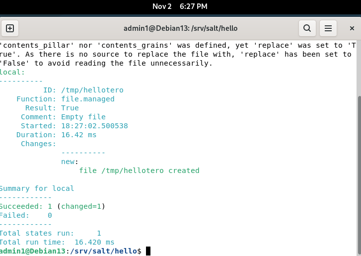

2.11.2025 19:04 ls /tmp/hellotero  

b) Toppping. Tee top-file, niin että kaikki omat tilasi ajetaan kerralla komennolla 'sudo salt-call --local state.apply'.  
-
2.11.2025 19:16 sudo touch top.sls  
2.11.2025 19:27 sudo nano /srv/salt/hello.sls  
2.11.2025 19:31 sudo nano top.sls  
top.sls kansion sisältö:  
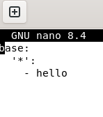  

2.11.2025 19:32 ls /srv/salt/  
2.11.2025 19:38 sudo salt-call --local state.apply  
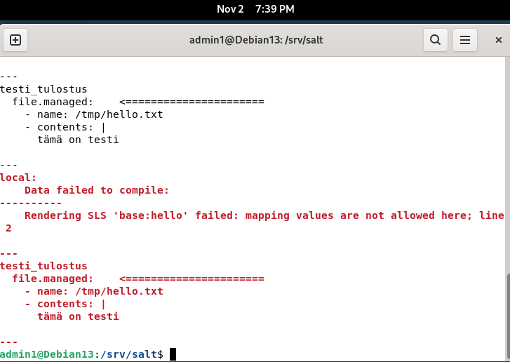

Syntaksi virhe.  
2.11.2025 19:44 ls  
2.11.2025 19:44 sudo nano hello.sls  
Korjaus tiedostoon. Lisättiin kaksoispiste ensimmäisen rivin loppuun.  
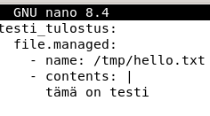  

2.11.2025 sudo salt-call --local state.apply  
Uusi syntaksi virhe.  
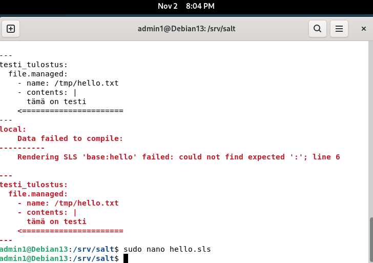  
2.11.2025 20:03 sudo nano hello.sls  

Lisättiin välejä ennen "tämä on testi"  
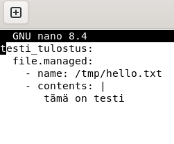  

2.11.2025 20:13 sudo salt-call --local state.apply hello  
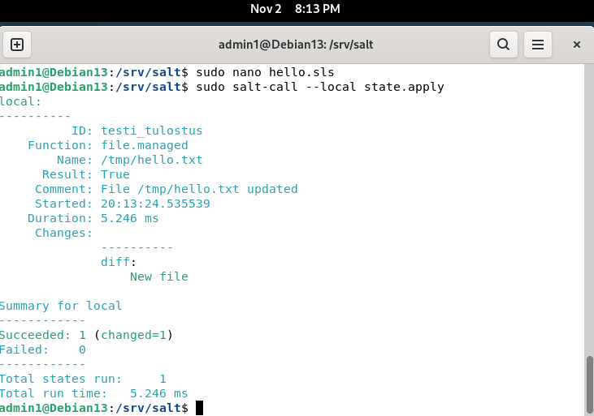  

c) Tee erilliset esimerkit kustakin viidestä tärkeimmästä tilafunktiosta pkg, file, service, user, cmd.  
-
2.11.2025 20:43  
Luotiin hakemistot:  
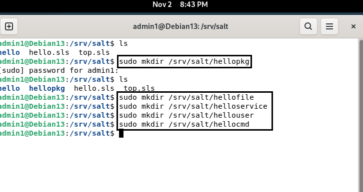  

2.11.2025 21:22  
Viiden tilafunktion init.sls tiedostot:  
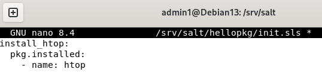  
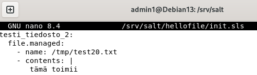  
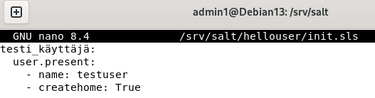  
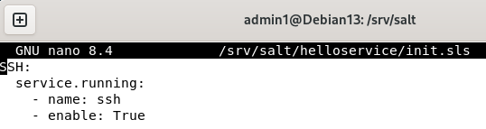  
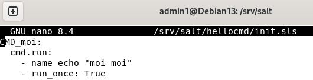  

Päivitetty top.sls tiedosto:
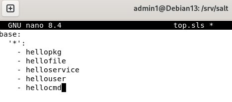
2.11.2025 20:  
2.11.2025 20:  
2.11.2025 20:  
2.11.2025 20:  
2.11.2025 20:  
2.11.2025 20:  

d) Tee sls-tiedosto, joka käyttää vähintään kahta eri tilafunktiota näistä: package, file, service, user. Tarkista eri ohjelmalla, että lopputulos on oikea.  
-

Lähteet: Karvinen, Tero 2024. Hello Salt Infra-as-Code. Luettavissa: https://terokarvinen.com/2024/hello-salt-infra-as-code/  
Salt Project. (n.d.). Salt user guide. Luettavissa: https://docs.saltproject.io/salt/user-guide/en/latest/topics/overview.html#rules-of-yaml  
Salt Project. 2025. xxx. Luettavissa: https://docs.saltproject.io/en/latest/ref/states/top.html  
