Tässä on aluksi tekemäni virheellinen tapaus, jossa ongelmana oli virtualisaation yritys virtuaalikoneen sisällä.  
Uuden ja paremmin toimivan version tehtävästä löydät täältä: [Uusi versio](#versio2)
## versio1

x)

**Karvinen 2021: Two Machine Virtual Network With Debian 11 Bullseye and Vagrant**  
Artikkeli ohjeistaa, kuinka asentaa Vagrant, miten määritellä asetukset uusille virtuaalikoneille.  

**Karvinen 2018: Salt Quickstart – Salt Stack Master and Slave on Ubuntu Linux**  
Nopea ohjeistus siitä, miten Salt Stack herra & orja asennetaan, ja otetaan käyttöön.

**Karvinen 2023: Salt Vagrant - automatically provision one master and two slaves**  
 - Infra as Code - Your wishes as a text file  
 - top.sls - What Slave Runs What States
   
Näissä kohdissa kerrotaan, miten tehdään yksinkertainen tilatiedosto, ja kuinka top.sls tiedostoa käytetään niiden ajamisessa.  

a)  Vagrant asennus  
-
6.11.2025 20:43 sudo apt update  

Käytin Vagrantin asentamiseen koodinpätkää hashicorpin viralliselta sivulta.  

6.11.2025 20:47 wget -O - https://apt.releases.hashicorp.com/gpg | sudo gpg --dearmor -o /usr/share/keyrings/hashicorp-archive-keyring.gpg
echo "deb [arch=$(dpkg --print-architecture) signed-by=/usr/share/keyrings/hashicorp-archive-keyring.gpg] https://apt.releases.hashicorp.com $(grep -oP '(?<=UBUNTU_CODENAME=).*' /etc/os-release || lsb_release -cs) main" | sudo tee /etc/apt/sources.list.d/hashicorp.list
sudo apt update && sudo apt install vagrant

6.11.2025 20:50 sudo apt install lsb-release  
6.11.2025 21:06 lsb_release -a  
6.11.2025 21:06 vagrant --version  

b) Linux Vagrant. Tee Vagrantilla uusi Linux-virtuaalikone.  
-

Vagrantfile määritykset kahdelle koneelle:  

6.11.2025 22:01 sudo apt update  

Virtualisointi on estetty BIOS tasolla?  

6.11.2025 22:44 Päätin vielä yrittää 32 bittistä debian boxia.  

8.11.2025 18:13 sudo apt update  
8.11.2025 18:15 sudo apt-get update  
8.11.2025 18:20 sudo apt-get install vagrant virtualbox  
Tämä oli jo ladattuna.  

8.11.2025 18:23 Muutin Vagrantin konfigurointi tiedostoa aikaisemmasta.
  
  

8.11.2025 18:54 vagrant up  
Uusi virhe, mutta tämä on vain syntaksi virhe kohdassa:  
"config.vm.synched_folder"  

Oikein tämä olisi:  
"config.vm.synced_folder"  
  

Mutta tämä ei vieläkään toimi:  
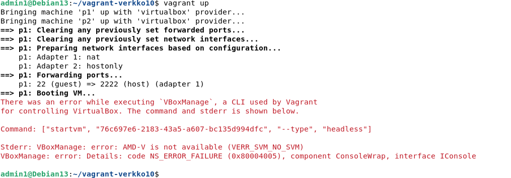

8.11.2025 20:28 sudo apt update  
8.11.2025 20:28 sudo apt install qemu-kvm libvirt-daemon-system libvirt-clients bridge-utils virt-manager cpu-checker  

Yritin löytää syitä miksi nested virtualisointi ei toimi.   
Yritin etsiä, jos Hyper-V jotenkin estäisi tämän, ja onko se edes päällä tai olemassa.  

Tein muutoksia omaan pääkoneeseeni.  
Poistin Windowsin ominaisuuden: "Virtual Machine Platform" pois päältä.   
Pääkoneen CPU on moderni ja siinä pitäisi tarvittavat ominaisuudet olla:  
AMD Ryzen 7 7730U  
Pääkoneessa on Windows 11 Home ja BIOS:in sisällä: virtualization technology = enabled  
Oracle VirtuaBox asetuksissa nested virtualisointi on päällä.
Yritin löytää ratkaisuja virtuaalikoneen sisällä eri sovelluksista, kernel moduuleista, mutta näillä ei lopuksi ollut merkitystä.  
En löytänyt syytä, mikä todellisesti estää nested virtualisoinnin.  
Tässä mahdollisesti hyödyllistä tietoa asetuksistani:  

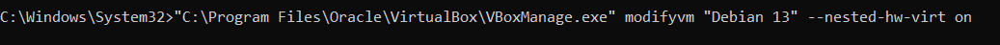  
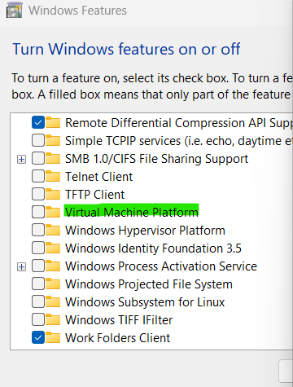  

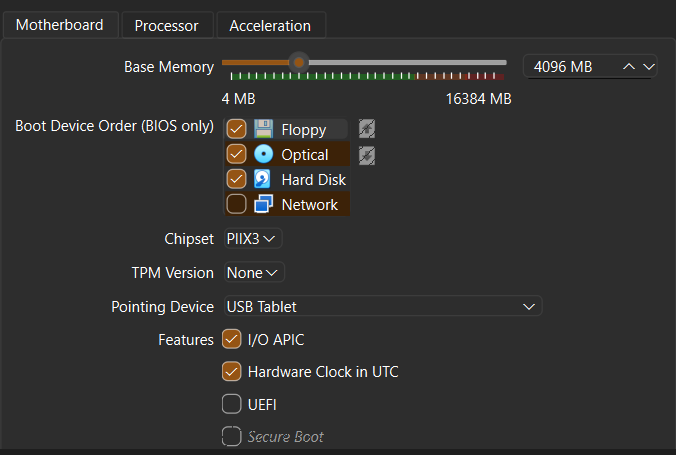  
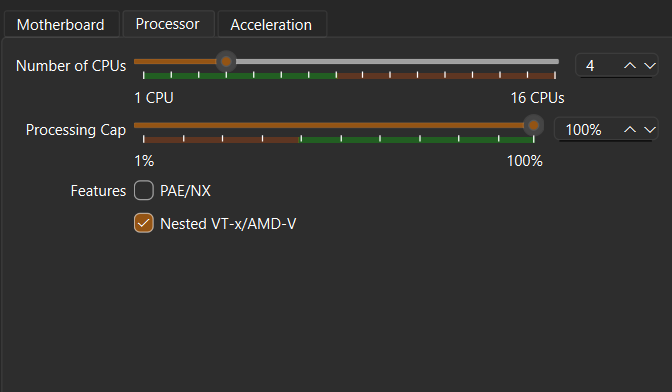  
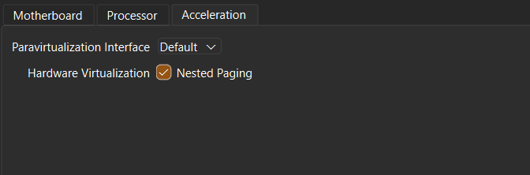  

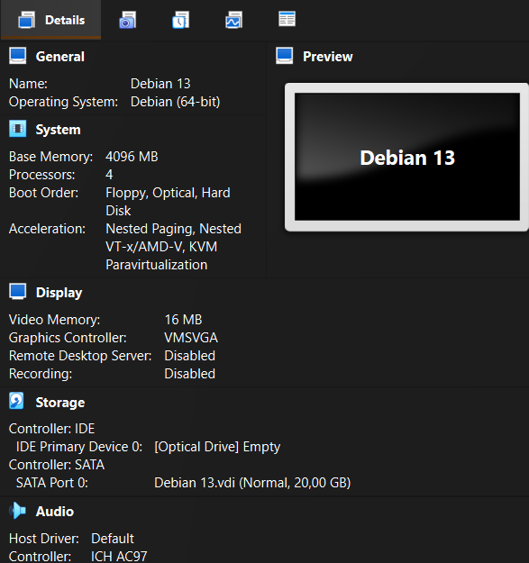  
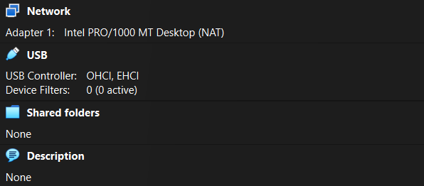  

Loppu.

c)  
-

d)
-

e)
-
---------------------------------------------------------------------------------------------------------------------

[Takaisin ylös](#versio1)
## versio2
a) Vagrant asennus  
-
Windows 11 pääkoneellani latasin Hashicorpin Vagrant 64-bittisen version (AMD64)  
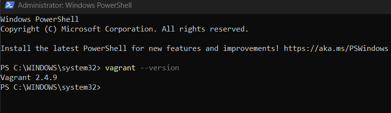

b) Tee Vagrantilla uusi Linux-virtuaalikone  
-

Tein hakemiston ja tämän jälkeen tein asetukset virtuaalikoneille. 
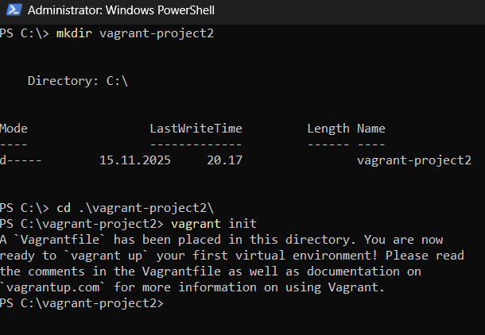  
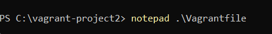  

Vagrantfile:  
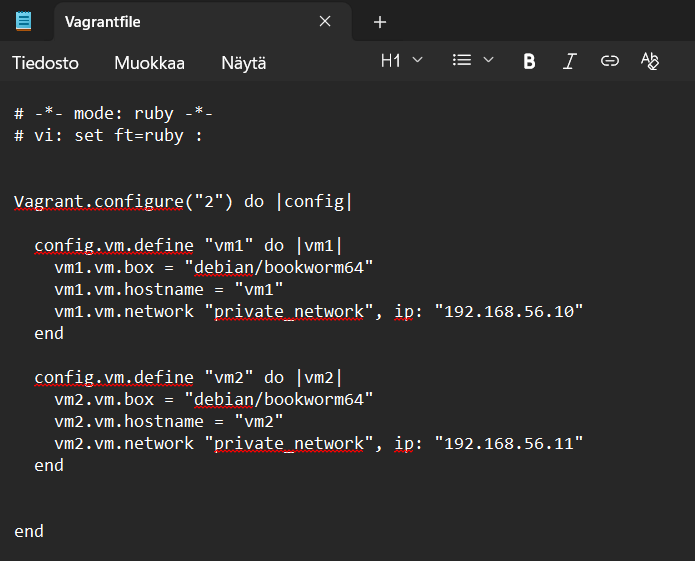

c) Kahden Linux-tietokoneen verkko Vagrantilla  
-

Kahden koneen verkko:  
kone_1  
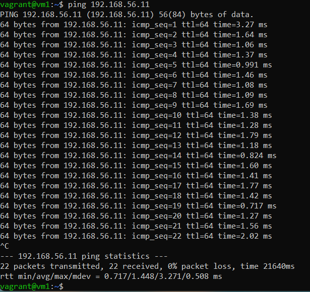  

kone_2  
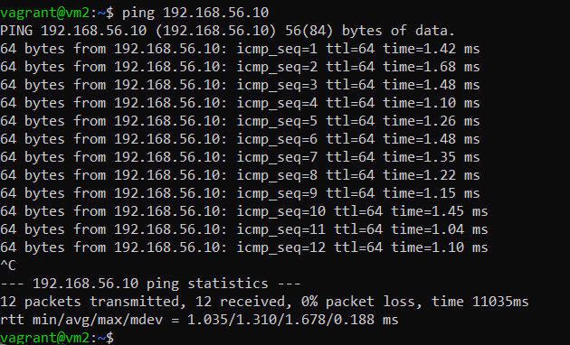  

d)  
-

Otin ssh yhteyden ja asensin Salt masterin koneelle vm1.

sudo apt update  
sudo apt upgrade  
sudo apt install salt-master  
(Error)  

sudo apt install curl gnupg2 lsb-release  

Tässä vaiheessa DNS:n kanssa alkoi tulla ongelmia.  
Ilman seuraavaa väliaikaista korjausta en saisi Salt-masteria toimimaan.  

echo -e "nameserver 8.8.8.8\nnameserver 8.8.4.4" | sudo tee /etc/resolv.conf > /dev/null  
ping -c 3 google.com  
echo "13.35.156.119 d39c38qjhaa4za.cloudfront.net" | sudo tee -a /etc/hosts
curl -o SALT-PROJECT-GPG-PUBKEY-2023.pub https://repo.saltproject.io/salt/py3/debian/12/amd64/latest/SALT-PROJECT-GPG-PUBKEY-2023.pub

En millään saanut avainta normaaliin tapaan, joten päätin ladata avaimen ensin pääkoneelleni ja sieltä sijoittaa sen virtuaalikoneille.

isäntä ei voi selvittää Salt-projektin verkkotunnusta.

e)  ---------

Ongelma liittyi saltin asennuksen puutteeseen.  
Edes salt-minion tai sen tarvitsemat työkalut eivät olleet asennettuna.  
Seuraavaksi olisi tarkoitus mennä vm2 etc/salt/minion ja kertoa herran IP.  
Käynnistää orja uudestaan.  
Mennä herralle ja hyväksyä avain orjalta.  
Herra koneessa on olettaen puutteita, mutta kyse on täysin vain saltin asennuksesta.  
Herralle pitäisi tehdä salt-tiloja ja myös top tiedosto.  
Lisätä top tiedostoon .sls tiedostojen nimet ja käskeä nämä käytettäväksi orja koneessa.  

Lähteet: 
Vagrant. Install Vagrant. Luettavissa: https://developer.hashicorp.com/vagrant/install#linux  
Karvinen, Tero 2021. Two Machine Virtual Network With Debian 11 Bullseye and Vagrant. Luettavissa: https://terokarvinen.com/2021/two-machine-virtual-network-with-debian-11-bullseye-and-vagrant/  
