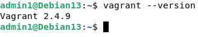
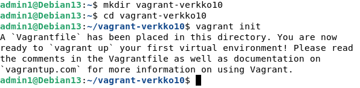
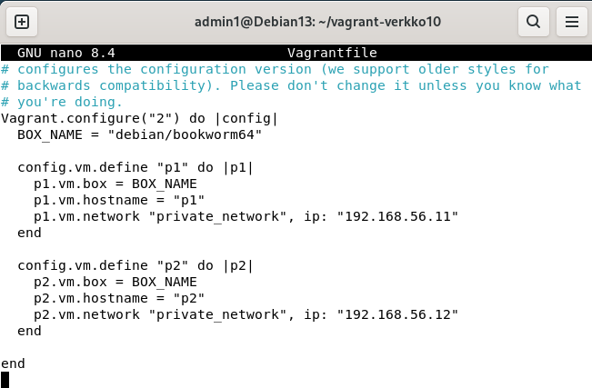
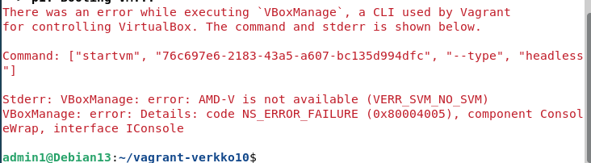
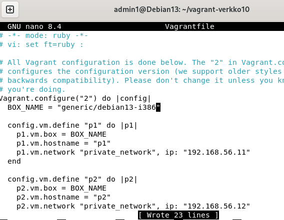
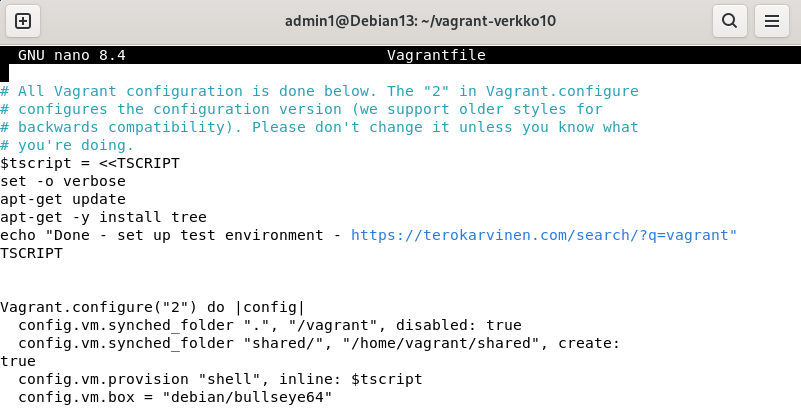
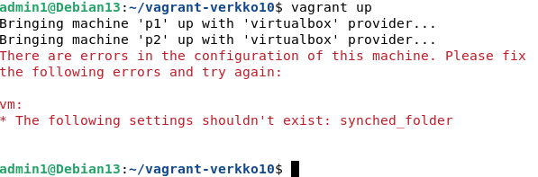

x)

**Karvinen 2021: Two Machine Virtual Network With Debian 11 Bullseye and Vagrant**  
Artikkeli ohjeistaa, kuinka asentaa Vagrant, miten määritellä asetukset uusille virtuaalikoneille.  

**Karvinen 2018: Salt Quickstart – Salt Stack Master and Slave on Ubuntu Linux**  
Nopea ohjeistus siitä, miten Salt Stack herra & orja asennetaan, ja otetaan käyttöön.

**Karvinen 2023: Salt Vagrant - automatically provision one master and two slaves**  
 - Infra as Code - Your wishes as a text file  
 - top.sls - What Slave Runs What States  
Näissä kohdissa kerrotaan, miten tehdään yksinkertainen tilatiedosto, ja kuinka top.sls tiedostoa käytetään niiden ajamisessa.  

a)  Vagrant asennus  
-
6.11.2025 20:43 sudo apt update  

Käytin Vagrantin asentamiseen koodinpätkää hashicorpin viralliselta sivulta.  

6.11.2025 20:47 wget -O - https://apt.releases.hashicorp.com/gpg | sudo gpg --dearmor -o /usr/share/keyrings/hashicorp-archive-keyring.gpg
echo "deb [arch=$(dpkg --print-architecture) signed-by=/usr/share/keyrings/hashicorp-archive-keyring.gpg] https://apt.releases.hashicorp.com $(grep -oP '(?<=UBUNTU_CODENAME=).*' /etc/os-release || lsb_release -cs) main" | sudo tee /etc/apt/sources.list.d/hashicorp.list
sudo apt update && sudo apt install vagrant

6.11.2025 20:50 sudo apt install lsb-release  
6.11.2025 21:06 lsb_release -a  
6.11.2025 21:06 vagrant --version  

b) Linux Vagrant. Tee Vagrantilla uusi Linux-virtuaalikone.  
-

Vagrantfile määritykset kahdelle koneelle:  

6.11.2025 22:01 sudo apt update  

Virtualisointi on estetty BIOS tasolla.  

6.11.2025 22:44 Päätin vielä yrittää 32 bittistä debian boxia.  

8.11.2025 18:13 sudo apt update  
8.11.2025 18:15 sudo apt-get update  
8.11.2025 18:20 sudo atp-get install vagrant virtualbox  
Tämä oli jo ladattuna.  

8.11.2025 18:23 Muutin Vagrantin konfigurointi tiedostoa aikaisemmasta.
  
  

8.11.2025 18:54 vagrant up  
Uusi virhe, mutta tämä on vain syntaksi virhe kohdassa:  
"config.vm.synched_folder"  

oikein tämä olisi:  
"config.vm.synced_folder"  
  

c)  
-

Lähteet: Vagrant. https://developer.hashicorp.com/vagrant/install#linux  
