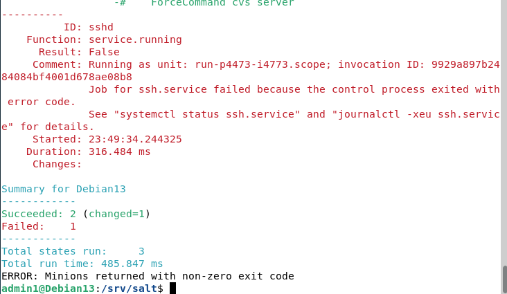
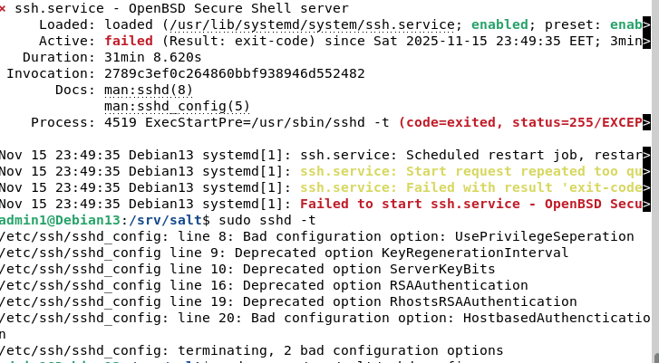
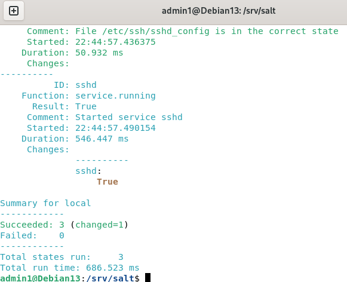
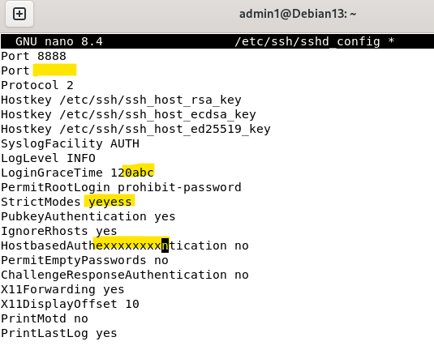
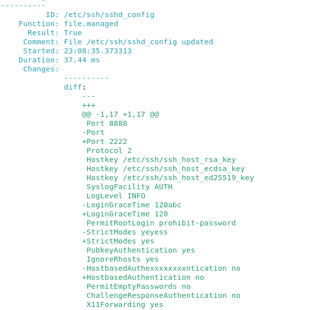
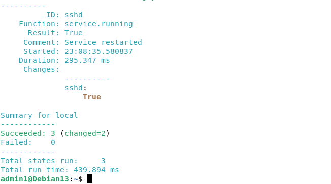

x)
h4 Pkg-file-service

Artikkelissa kerrotaan, miten Saltin avulla voidaan ohjata useita eri prosesseja samaan aikaan.  

- Package-file-service on yleisin malli tähän tarkoitukseen.  
- Tässä näytetään Salt-tila SSH-palvelimen portin vaihtamiseksi.  

a) SSHouto. Lisää uusi portti, jossa SSHd kuuntelee  
-

Muokkasin tiedostoa /etc/ssh/sshd_config  
Porttejen arvot ovat 2222 ja 8888  

Virhe tuli muutamiin kohtiin, ja vaihdoin nämä.

Poistin nämä kohdat tiedostosta:  
UsePrivilegeSeparation yes  
KeyRegenerationInterval 3600  
ServerKeyBits 1024  
RSAAuthentication yes  
RhostsRSAAuthentication no  
HostKey /etc/ssh/ssh_host_dsa_key  

Huomasin myös pienen typon:  

sudo mkdir /run/sshd  
sudo chmod 755 /run/sshd  
sudo sshd -t  

kopion toimivan tiedoston:  
sudo cp /etc/ssh/sshd_config /srv/salt/sshd_config  
sudo chmod 644 /srv/salt/sshd_config  

Tein vielä testauksia, jos /etc/ssh/sshd_config olisi muuttunut:  

Lähteet:
Karvinen, Tero 2018. Pkg-File-Service – Control Daemons with Salt – Change SSH Server Port. Luettavissa: https://terokarvinen.com/2018/04/03/pkg-file-service-control-daemons-with-salt-change-ssh-server-port/?fromSearch=karvinen%20salt%20ssh  
