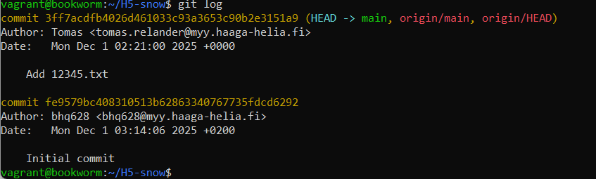
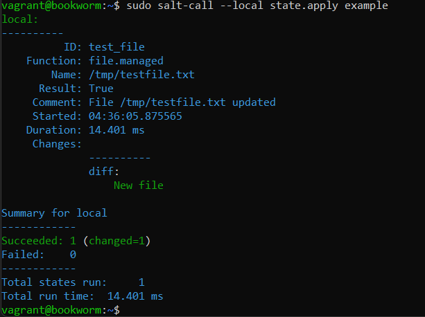
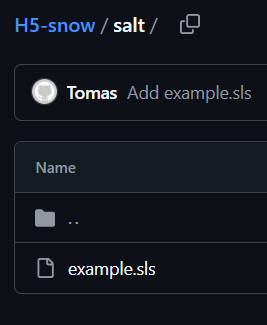

x) Tiivistelmä  

- Chacon and Straub 2014. Pro Git  
Kirja kertoo Git versionhallinnasta, ja kuinka käyttää sitä.
Git toimii suurimmalta osin paikallisesti.
Gitissä on mahdotonta muokata tiedosta ilman, että Git ei tietäisi siitä.  

- Gitin käyttö  
"git add ." on alkuvaihe, jossa tehdyt muutokset merkataan valmistelualueelle.  
"git commit" on paikallinen tallennus tehdyistä muutoksista, jotka on esitetty "git add ." komennon avulla.  
"git pull" vetää varastosta muutokset, jos niitä joku muu on ehtinyt muokkaamaan ennen sinua. 
"git push" työntää tehdyt muutoksesi gittiin. Tämän jälkeen muut näkevät tehdyt muutoksesi.  

- Suolax  
Suolax muutoksissa on tehty:  
Aluksi readme.md ja tämän sisältö.  
Hello world salt-tila.  
Lisätty salt-tila, jossa paketti "tree" sisältö on asennettu.
Lisätty top tiedosto.
Make oikotie lisäys. Tämän avulla otetaan käyttöön kaikki paketit.  
Readme.md siistiminen.  

a) Tee uusi varasto  
-

Uusi Varasto  

b) Kloonaa varasto ja tee muutoksia
-

Tein vagrantilla uuden koneen ja asensin Gitin.  
Tänne tulen kloonaamaan Github sivuni.  

Tein muutoksen ja tämä säilytetään.  

Tämän toin Githubin puolelle.  

c) Tuhoa huonot muutokset  
-

Tein muutoksia, mutta nämä peruutetaan.  

d) Tarkastele ja selitä varastosi lokia
-

Tässä näkyy tehdyt commit viestit, nimi ja sähköpostini.  

e)  Aja Salt-tiloja omasta varastostasi  
-

Lähteet: Chacon and Straub 2014. Pro Git. Luettavissa: https://git-scm.com/book/en/v2/Getting-Started-What-is-Git%3F  
Karvinen, Tero. Github. Saatavilla: https://github.com/terokarvinen/suolax/  
Stack Overflow. Luettavissa: https://stackoverflow.com/questions/6143285/git-add-vs-push-vs-commit  
