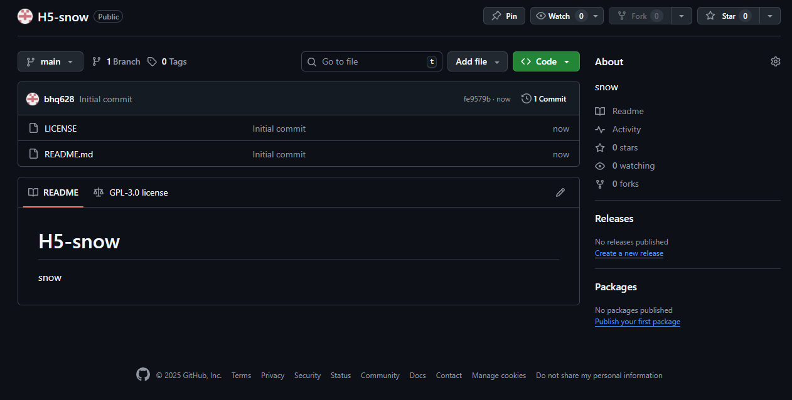
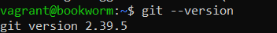
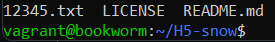
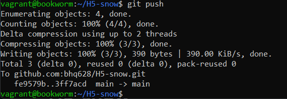
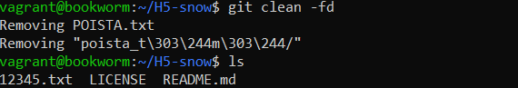
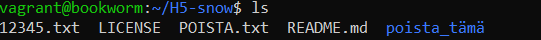

x)  

a) Tee uusi varasto  
-

Uusi repo  

b) Kloonaa varasto ja tee muutoksia
-

Tein vagrantilla uuden koneen ja asensin Gitin.  
Tänne tulen kloonaamaan Github sivuni.  

Tein muutoksen ja tämä säilytetään.  

Tämän toin Githubin puolelle.  

c) Tuhoa huonot muutokset  
-

Tein muutoksia, mutta nämä peruutetaan.  

